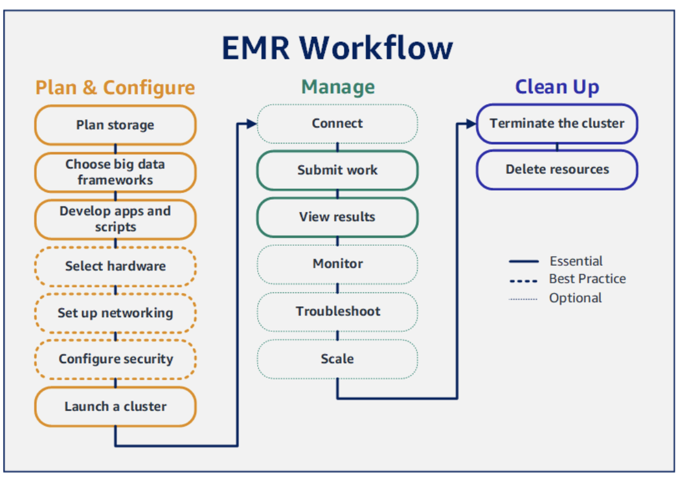
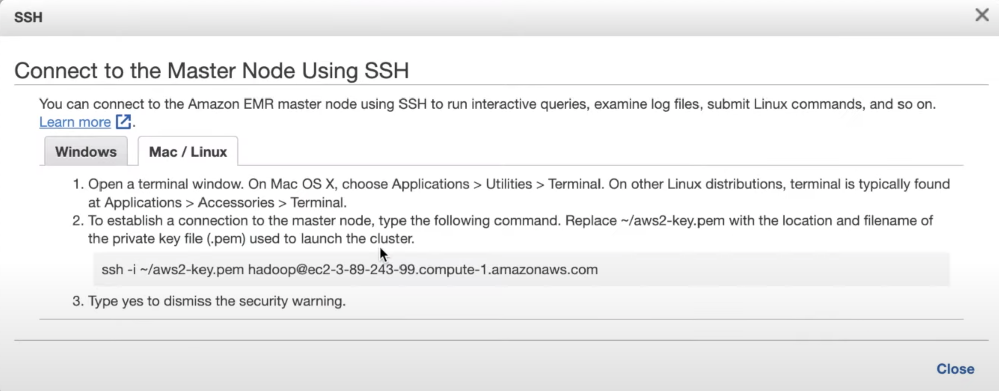

# Getting started with Amazon EMR
 
### Overview
 
For detailed information on Amazon EMR please click [Amazon EMR documentation guide](https://docs.aws.amazon.com/emr/latest/ManagementGuide/emr-gs.html). With Amazon EMR you can set up a cluster to process and analyze data with big data frameworks in just a few minutes.This tutorial shows you how to launch a sample cluster using Spark, and how to run a simple PySpark script stored in an Amazon S3 bucket.
 
We will be deploying a python script which reads two files and joins them into one file into an EMR cluster and we will save the output in an s3 bucket.
 
 

Figure 1: [EMR workflow](https://docs.aws.amazon.com/emr/latest/ManagementGuide/emr-gs.html)
 
## Planning and configure

### Step 1 : [Creating an S3 bucket.](https://docs.aws.amazon.com/AmazonS3/latest/userguide/create-bucket-overview.html)
 
Using the S3 console
Sign in to the AWS Management Console with your username and password and open the Amazon S3 console at https://console.aws.amazon.com/s3/.
 
1. Choose Create bucket.The Create bucket wizard opens.
 
2. In Bucket name, enter a bucket name. After you create the bucket, you cannot change its name. For information about naming buckets, see [Bucket naming rules](https://docs.aws.amazon.com/AmazonS3/latest/userguide/bucketnamingrules.html).
 
4. In Region, choose the AWS Region such us EU west 1 or EU west 2.Choose a Region close to you to minimize latency and costs.
 
5. Under Object Ownership ACLs disabled
 
6. In Bucket settings choose the Block Public Access settings.
 
7. Under Bucket Versioning, Enable.
 
8. Optional. To add a bucket tag, enter a Key and optionally a Value and choose Add Tag.
 
9. Enable encryption
 
10. Choose Create bucket.
 
11. Click on the bucket name to go the bucket
 
12. Click create folder and create two folders DATA_SOURCE and DATA_OUTPUT
 
13. Choose the DATA_SOURCE folder and choose Upload
 
14. Under Files and folders, choose Add files.
 
15. Choose a files  [x_list.txt](/DATA_SOURCE/x_list.txt) and [y_list.txt](/DATA_SOURCE/y_list.txt) to
   upload, and then choose Open.
 
16. Choose Upload.
 
You've successfully uploaded files to your bucket. Note: The maximum size of a file that you can upload by using the Amazon S3 console is 160 GB. To upload a file larger than 160 GB, use the [AWS CLI](https://docs.aws.amazon.com/cli/latest/userguide/cli-chap-welcome.html), AWS SDK, or Amazon S3 REST API.
 
## Step 2: PySpark script for EMR
 
1. Copy the example code below into a new file in your editor of choice and save as analysis.py or you can find the file in the [python-pandas](/python-pyspark) folder named [analysis.py](/python-pyspark/analysis.py).
 
 
```python
import argparse
from pyspark.sql import SparkSession
from pyspark.sql.types import StructType, StructField, StringType
 
def merge_two_files(data_source_1,data_source_2,output_uri):
   """
   Merge 2 files into 1
  
   Usage
  
   spark-submit analysis.py --data_source_1 x_list.txt --data_source_2 y_list.txt --output_uri /uri/output/folder/to/store/results
  
   for example /Users/johnpaulbabu/Documents/pyspark/output
   """
   spark=SparkSession.builder.appName("merge-two-files").getOrCreate()
  
   x_schema = StructType([
   StructField("ID_x", StringType(), True),
   StructField("value_x", StringType(), True)])
  
   y_schema = StructType([
   StructField("ID_y", StringType(), True),
   StructField("value_y", StringType(), True)])
  
   if data_source_1 is not None:
     x = spark.read.csv(data_source_1, sep='\t',header=False,schema=x_schema)
  
   if data_source_2 is not None:
     y = spark.read.csv(data_source_2, sep='\t', header=False, schema=y_schema)
  
   res = x.join(y, x.ID_x == y.ID_y, how= "left")
   res1 = res.drop(res.ID_y)
   res1.show()
   res1.write.option("header", "true").mode("overwrite").csv(output_uri)
 
if __name__ == "__main__":
   parser = argparse.ArgumentParser()
   parser.add_argument(
       '--data_source_1', help="The URI for your input CSV data, like an S3 bucket location.")
   parser.add_argument(
       '--data_source_2', help="The URI for your input CSV data, like an S3 bucket location.")
   parser.add_argument(
       '--output_uri', help="The URI where output is saved, like an S3 bucket location.")
   args = parser.parse_args()
  
 
   merge_two_files(args.data_source_1, args.data_source_2,args.output_uri)
```
2. Upload analysis.py to Amazon S3 into the bucket you created for this tutorial. You can also create a new 
   folder named python-scripts in s3 bucket and upload the analysis.py into it. 
 
### Step 3: [Create EC2 key pair](https://docs.aws.amazon.com/AWSEC2/latest/UserGuide/create-key-pairs.html)
 
1. Open the Amazon EC2 console at https://console.aws.amazon.com/ec2/.
 
2. In the navigation pane, under Network & Security, choose Key Pairs.
 
3. Choose Create key pair.
 
4. For Name, enter a descriptive name for the key pair.
 
5. For Key pair type, choose either RSA or ED25519.
 
6. For Private key file format, choose the format pem.
 
7. Choose Create key pair.
 
8. The private key file is automatically downloaded by your browser. The base file name is the name that you specified as the name of your key pair, and the file name with extension .pem. Save the private key file in a safe place.
 
9. Change the file permission of the key pair by chmod 400 by providing the file path where the key is stored.
 
```shellcommand
 
chmod 400 filepath/key-pair-name.pem
 
```
 
### Step 4: Launch an Amazon EMR cluster
 
 
1. To launch an EMR cluster Sign in to the AWS Management Console, and open the Amazon EMR console at https://console.aws.amazon.com/emr/.
 
2. Under EMR on EC2 in the left navigation pane, choose Clusters, and then choose Create cluster.
 
3. In the Create Cluster page, note the default values for Release, Instance type, Number of instances, and Permissions. These fields automatically populate with values that work for general-purpose clusters.
 
4. In the Cluster name field, enter a unique cluster name to help you identify your cluster.
 
5. Under Applications, choose the Spark option to install Spark on your cluster.
 
6. Under Cluster logs, select the Publish cluster-specific logs to Amazon S3 check box. Replace the Amazon S3 location value with the Amazon S3 bucket you created, followed by /logs. For example, s3://DOC-EXAMPLE-BUCKET/logs. Adding /logs creates a new folder called 'logs' in your bucket, where Amazon EMR can copy the log files of your cluster.
 
7. Under Security configuration and permissions, choose your EC2 key pair. In the same section, select the Service role for Amazon EMR dropdown menu and choose EMR_DefaultRole. Then, select the IAM role for instance profile dropdown menu and choose EMR_EC2_DefaultRole.
 
8. Choose Create cluster to launch the cluster and open the cluster details page.
 
9. Find the cluster Status next to the cluster name. The status changes from Starting to Running to Waiting
  as Amazon EMR provisions the cluster. You may need to choose the refresh icon on the right or refresh your browser to see status updates.

## Manage
 
### Step 5: Submit work to Amazon EMR

**Note we can also do this step to submit the code through ssh from the local machine to know more refer step 6 below.** 
 
1. Under EMR on EC2 in the left navigation pane, choose Clusters, and then select the cluster where you want to submit work. The cluster state must be Waiting.


 
2. Choose the Steps tab, and then choose Add step.
 
3. Configure the step according to the following guidelines:
 
4. For Type, choose Spark application. You should see additional fields for Deploy mode, Application location, and Spark-submit options.
 
5. For Name, enter a new name. If you have many steps in a cluster, naming each step helps you keep  track of
  them.
 
6. For Deploy mode, leave the default value Cluster mode.
 
7. For Application location, enter the uri of the amazon s3 location of your analysis.py script in Amazon S3,
  such as s3://DOC-EXAMPLE-BUCKET/analysis.py.
 
8. Leave the Spark-submit options field empty.
 
9. In the Arguments field, enter the following arguments and values:
 
 
 
   --data_source-1 s3://DOC-EXAMPLE-BUCKET/DATA_SOURCE/x_list.txt
   --data_source-2 s3://DOC-EXAMPLE-BUCKET/DATA_SOURCE/y_list.txt
   --output_uri s3://DOC-EXAMPLE-BUCKET/OutputFolder
 
   Replace s3://DOC-EXAMPLE-BUCKET/DATA_SOURCE/x_list.txt and  s3://DOC-EXAMPLE-BUCKET/DATA_SOURCE/y_list.txt with the S3 bucket URI of your input data in amazon s3.
 
    Replace DOC-EXAMPLE-BUCKET with the name of the bucket that you created for this tutorial, and replace OutputFolder with a name for your cluster output folder.
 
10. For Action if step fails, accept the default option Continue. This way, if the step fails, the cluster continues to run.
 
11. Choose Add to submit the step. The step should appear in the console with a status of Pending.
 
12. Monitor the step status. It should change from Pending to Running to Completed. To refresh the status in the console, choose the refresh icon to the right of Filter. The script takes about one minute to run. When the status changes to Completed, the step has completed successfully.
 
### Step 6: (Optional) Connect to a running EMR cluster to read log files and debug the cluster
 
 
1. Under EMR on EC2 in the left navigation pane, choose Clusters, and then choose the cluster you created.
  This opens up the cluster details page
2. Under security and access click the link security group for master it takes us to a security group page.
3. Select security group ID for master this take us to another page where we can see a button to edit inbound
  rules. Click on the button.
4. Scroll all the way down and click the add rule.
5. Scroll to the bottom of the list of rules and choose Add Rule.
6. For Type, select SSH. Selecting SSH automatically enters TCP for Protocol and 22 for Port Range.
7. For source, select My IP to automatically add your IP address as the source address and click save rule.
6. Go back to the cluster page and click the link to connect to a master node using ssh.
7. This will open a link with instructions to ssh into the EMR cluster

8. Open the terminal
9. Type the following command. Replace ec2-###-##-##-###.compute-1.amazonaws.com with the master public DNS
  name of your cluster and replace ~/mykeypair.pem with the full path and file name of your .pem file.
```shellcommand
 ssh hadoop@ec2-###-##-##-###.compute-1.amazonaws.com -i /mykeypair.pem
```
10. There is a bug in the amazon documentation, do not put  ~ in front of the .pem ec2 key pair path.
11. Remember to change the permission of the ec2 key pair key to Chmod 400.
12. Than using Step 6 above to submit work, you can also submit the code to the amazon EMR through ssh. 
13. Type 


   ```shellcommand 

   vi analysis.py 

   ```in the terminal and click enter. 

14. Type i to edit. 
15. Copy and paste the python script from the file [analysis.py]() to the terminal editor. 
16. Click escape and type 
```shellcommand
:wq

````
to save the file 

17. Type the command by replacing the <path in s3 bucket > with the respective s3 bucket uri. 

```shellcommand

spark-submit analysis.py --data_source_1 <path in s3 bucket > --data_source_2 < path in s3 bucket >  --output_uri <path in s3 bucket>

````


### Step 6: View results
 
After a step runs successfully, you can view its output results in your Amazon S3 output folder.
 
1. To view the results of analysis.py Open the Amazon S3 console at https://console.aws.amazon.com/s3/.
 
2. Choose the Bucket name and then the output folder that you specified when you submitted the step.
  For example, DOC-EXAMPLE-BUCKET and then OutputFolder.
 
3. Verify that the following items appear in your output folder: A small-sized object called _SUCCESS.
  A txt file starting with the prefix part- that contains your results.
 
4. Choose the object with your results, then choose Download to save the results to your local file system.
 
5. Open the results in your editor of choice. The output file lists the top ten food establishments with the most red violations. The output file also shows the total number of red violations for each establishment.
 
6. The following is an example of analysis.py results.

## Cleanup
 
### Step 7: Clean up your Amazon EMR resources by Terminating your cluster
 
Now that you've submitted work to your cluster and viewed the results of your PySpark application, you can terminate the cluster. The cluster also gets terminated automatically if inactive for the time we set during cluster creation. When you terminate a cluster, Amazon EMR retains metadata about the cluster for two months at no charge. Archived metadata helps you clone the cluster for a new job or revisit the cluster configuration for reference purposes. Metadata does not include data that the cluster writes to S3, or data stored in HDFS on the cluster.
 
 
 
1. Choose Clusters in EMR, and then choose the cluster you want to terminate.
 
2. Under the Actions drop down menu, choose Terminate cluster.
 
3. Choose Terminate in the dialog box. Depending on the cluster configuration, termination may take 5 to 10
  minutes. For more information on how to Amazon EMR clusters, see Terminate a cluster.
 
### Step 8: Delete S3 resources
To avoid additional charges, you should delete your Amazon S3 bucket. Deleting the bucket removes all of the Amazon S3 resources for this tutorial. Your bucket should contain:
 
1. The PySpark script
 
2. The input datasets
 
3. Your output results folder
 
4. Your log files folder
 
 
 

