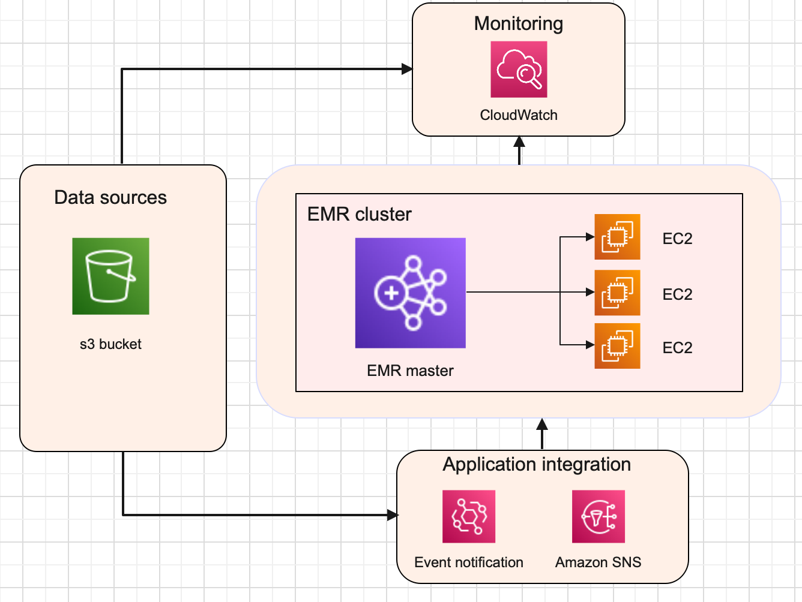

 
# **Executing a python script on aws cloud for big data analytics.**
 
## **Use Case**
Our use case focuses on a data scientist who just finished the attached Python script, with a view to run it on very large files (e.g. billions of rows).The data scientist needed help to package it up into a pipeline to run at scale on the cloud.
 
```python
 
import sys
import pandas as pd
import numpy as np
 
"""
Merge 2 files into 1
 
Usage:
python3 ./analysis.py x_list.txt y_list.txt
"""
 
def main():
   x = pd.read_csv(sys.argv[1], sep="\t")
   y = pd.read_csv(sys.argv[2], sep="\t")
   print(x)
 
   res = pd.DataFrame.from_records(
       [
           np.concatenate((x_row, y_row), axis=None)
           for x_index, x_row in x.iterrows()
           for y_index, y_row in y.iterrows()
       ],
       columns=["ID_x", "value_x","ID_y","value_y"],
   )
 
   print(res[res["ID_x"] == res["ID_y"]].drop(columns="ID_y"))
 
 
if __name__ == "__main__":
   main()
 
 
```
## **Solutions overview**
 
 
## **Data processing in [amazon EMR](https://aws.amazon.com/emr/) with [apache spark](https://aws.amazon.com/big-data/what-is-spark/) and data in [amazon S3 bucket](https://aws.amazon.com/s3/).**
 
Apache Spark is an open-source, distributed processing system used for big data workloads. It utilizes in-memory caching, and optimized query execution for fast analytic queries against data of any size. Amazon EMR is a managed service aws cloud service for big data processing, interactive analysis, and machine learning using open source frameworks such as Apache Spark.
 
The main parts of this architecture discussed here is in (Figure 1):
 

Figure 1. Data pipeline for running a python script on AWS EMR
 
1. A data source [amazon S3](https://aws.amazon.com/s3/) is where data files and python scripts are uploaded.
 
2. A data processing solution [AWS EMR](https://aws.amazon.com/emr/) where the above python script is executed. [AWS EMR](https://aws.amazon.com/emr/) (Elastic Map reduce) is a big data on demand server. It is preconfigured with spark hadoop etc. It has a master node and ec2 instances as worker nodes. The ec2 instances can be autoscaled. 

3. A s3 bucket to save the AWS EMR logs. The same data souce s3 bucket as in 1 can also be used to save the
   AWS EMR logs.  
 
### **Prepare the above python script for EMR**
 
The above python script is written using the open source [pandas](https://pandas.pydata.org/) python package and pandas has a disadvantage, pandas run operations on a single machine. In this solution  [Apache Spark](https://spark.apache.org/) is used. Apache Spark in an EMR cluster with multiple scalable EC2 machines. Inorder to make the python script optimized with Apache Spark, the script needed to be rewritten using Pyspark. [Pyspark](https://spark.apache.org/docs/latest/api/python/) is an open source python API for Apache Spark to process large datasets in distributed system. PySpark is an ideal fit for this use case with big data as it processes operations many times(100x) faster than Pandas. I have also added a script to save the output.
 
```python
 
import argparse
from pyspark.sql import SparkSession
from pyspark.sql.types import StructType, StructField, StringType
 
def merge_two_files(data_source_1,data_source_2,output_uri):
   """
   Merge 2 files into 1
  
   Usage
  
   spark-submit analysis.py --data_source_1 x_list.txt --data_source_2 y_list.txt 
   --output_uri /uri/output/folder/to/store/results
  
   for example /Users/johnpaulbabu/Documents/pyspark/output
   """
   spark=SparkSession.builder.appName("merge-two-files").getOrCreate()
  
   x_schema = StructType([
   StructField("ID_x", StringType(), True),
   StructField("value_x", StringType(), True)])
  
   y_schema = StructType([
   StructField("ID_y", StringType(), True),
   StructField("value_y", StringType(), True)])
  
   if data_source_1 is not None:
     x = spark.read.csv(data_source_1, sep='\t',header=False,schema=x_schema)
  
   if data_source_2 is not None:
     y = spark.read.csv(data_source_2, sep='\t', header=False, schema=y_schema)
  
   res = x.join(y, x.ID_x == y.ID_y, how= "left")
   res1 = res.drop(res.ID_y)
   res1.show()
   res1.write.option("header", "true").mode("overwrite").csv(output_uri)
 
if __name__ == "__main__":
   parser = argparse.ArgumentParser()
   parser.add_argument(
       '--data_source_1', help="The URI for your input CSV data, like an S3 bucket location.")
   parser.add_argument(
       '--data_source_2', help="The URI for your input CSV data, like an S3 bucket location.")
   parser.add_argument(
       '--output_uri', help="The URI where output is saved, like an S3 bucket location.")
   args = parser.parse_args()
  
 
   merge_two_files(args.data_source_1, args.data_source_2,args.output_uri)
```

**Output**
```shellscript

+----+-------+-------+
|ID_x|value_x|value_y|
+----+-------+-------+
|  ID|   Word|   droW|
|   A|  Hello|  olleH|
|   B|  World|  dlroW|
|   C|    How|    woH|
|   D|     Do|     oD|
|   E|    You|    uoY|
|   F|     Do|     oD|
|   G|      ?|      ?|
+----+-------+-------+

```

To test this script in a local machine please download the python-pyspark folder and follw the instructions in the [readme.md](/python-pyspark/readme.md) file in it. 

To know the detailed process of deploying the above [python script](/python-pyspark/analysis.py) in amazon EMR.
### [**Please click here for an EMR SOP**](/EMR-SOP.md).


 
### **Advantages of EMR**
* Updated with latest open source frameworks.
* Cost savings especially if we use spot instances or reserved instances for big data.
* Fully managed no cluster setup. 
* Use s3 storage.
* Different hardware choices.
* Code Deployment is easy.
* Integration with other AWS services.
* Long running and auto scaling.
* Reliability.
* Security.
* Monitoring.
* No data file size limit and no maximum run time like lamda function.
 
 
 
### **Disadvantages of EMR**
* Its ideal only for big data.
* Manually deploy and start the EMR clusters.
* We can set the ec2 instance termination periods but if our task execution completes before the termination
  period we will have to manually terminate the instances to save cost.
 
 
### **Conclusion**
 
AWS EMR has many advantages when it comes to big data processing as it uses Apache spark with distributed systems. AWS EMR is a good solution for our use case. Meanwhile if we do not need customization and control of the clusters, Amazon EMR offers a serverless option named [Amazon EMR serverless](https://aws.amazon.com/emr/serverless/). Using amazon EMR serverless we do not need to tune, operate, secure, optimize and manage the cluster. EMR serverless automatically provisions and scales  compute and memory resources required by applications. Customers only pay for the resources they use. EMR serverless is a more simplest  way for customers to run applications built using open source big data analytics frameworks in the cloud. 
 
 Figure 2: EMR serverless data pipeline architecture with CI/CD and local environment. 


 
## How would you set up the company’s cloud account to run pipelines securely and robustly?

1. Encrypting data at rest. 
2. Encrypting data in transit.
3. Network security, clusters in private subnets, and NAT to perform
   only outbound internet access.
4. Managing Identity and Access.Creating different users and user groups and creating
   permission policy. 
5. Forcing multifactor authentication with each account.
6. SSL/TLS to communicate with AWS resources. 
7. Advanced managed security services such as Amazon Macie, which assists
    in discovering and securing sensitive data that is stored in Amazon S3. 
8. Periodic [security auditing](https://docs.aws.amazon.com/general/latest/gr/
aws-security-audit-guide.html). 
9. Multi accounts for example production and development. 
10. Error handling.
11. Scalability.
12. Backups and snapshots.
 

### [**Please click here for an EMR SOP**](/EMR-SOP.md).


