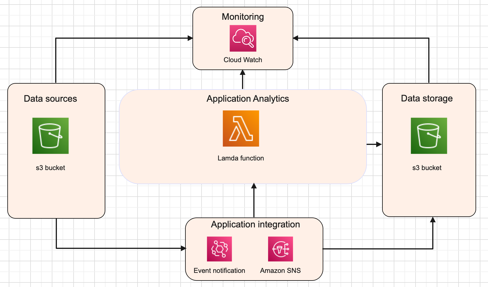

# Executing an existing python script on aws cloud for data analytics.
 
# Use Case
 
Our use case focuses on a data scientist who just finished the attached Python script, with a view to run it on very large files (e.g. billions of rows).The data scientist needed help to package it up into a pipeline to run at scale on the cloud.
 
The requirements for this workflow are:
 
 
# Solution overview
 
For this use case we plan to use Amazon AWS cloud infrastructure. The main parts of the architecture we discuss are (Figure 1):
 
1. A data source [amazon S3](https://aws.amazon.com/s3/) where we upload the persistent data.
 
2. A data processing solution an [aws lambda function](https://aws.amazon.com/lambda/) where we can run the
 python script, there are also other possible solutions such as [amazon EMR](https://aws.amazon.com/emr/), [amazon Glue](https://aws.amazon.com/glue/) or even containerizing the application and deploying it in [amazon ec2](https://aws.amazon.com/ec2/) or [amazon ecs](https://aws.amazon.com/ecs/) or [amazon eks](https://aws.amazon.com/eks/). But considering the robust infrastructure, cheap cost, ease of use and short runtime, I believe amazon lambda function should be able to handle the workload. Though it has some limitations which are discussed later in this document.

 
3. A data storage such as an [amazon S3](https://aws.amazon.com/s3/) where the results of the data processing can be stored.
 
4. Application integration module an [amazon event notification](https://aws.amazon.com/s3/)can monitor events happen in the S3 bucket and take actions based on those events such us run a lambda function or send a email when a file is uploaded to s3 through [amazon SNS](https://aws.amazon.com/sns/).
 
5. [Amazon cloudWatch logs](https://docs.aws.amazon.com/AmazonCloudWatch/latest/logs/WhatIsCloudWatchLogs.html) to monitor, store, and access your log files from AWS lambda function and s3.
  

Figure 1. Data pipeline for running a python script on very large files.

