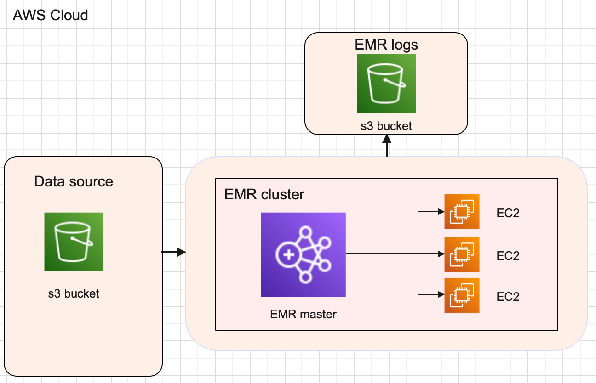

# **Executing an existing python script on aws cloud for data analytics.**

 
## **Use Case**
 
Our use case focuses on a data scientist who just finished the attached Python script, with a view to run it on very large files (e.g. billions of rows).The data scientist needed help to package it up into a pipeline to run at scale on the cloud.

```python

import sys
import pandas as pd
import numpy as np

"""
Merge 2 files into 1

Usage:
python3 ./analysis.py x_list.txt y_list.txt
"""

def main():
    x = pd.read_csv(sys.argv[1], sep="\t")
    y = pd.read_csv(sys.argv[2], sep="\t")
    print(x)

    res = pd.DataFrame.from_records(
        [
            np.concatenate((x_row, y_row), axis=None)
            for x_index, x_row in x.iterrows()
            for y_index, y_row in y.iterrows()
        ],
        columns=["ID_x", "value_x","ID_y","value_y"],
    )

    print(res[res["ID_x"] == res["ID_y"]].drop(columns="ID_y"))


if __name__ == "__main__":
    main()


```
 
 
## **Solutions overview** 


## **Data processing in [amazon EMR](https://aws.amazon.com/emr/) with [apache spark](https://aws.amazon.com/big-data/what-is-spark/) with data in [amazon S3 bucket](https://aws.amazon.com/s3/).**

Apache Spark is an open-source, distributed processing system used for big data workloads. It utilizes in-memory caching, and optimized query execution for fast analytic queries against data of any size. Amazon EMR is the industry-leading cloud big data platform for data processing, interactive analysis, and machine learning using open source frameworks such as Apache Spark. 

The main parts of this architecture we discuss are (Figure 2):


Figure 2. Data pipeline for running a python script on AWS EMR

1. A data source [amazon S3](https://aws.amazon.com/s3/) is where data files are uploaded.

2. A data processing solution an [AWS EMR](https://aws.amazon.com/emr/) where the above python script is exxecuted. [AWS EMR](https://aws.amazon.com/emr/) (Elastic Map reduce) is a big data on demand server. It is preconfigured with spark hadoop etc. It has a master node and ec2 intances as worker nodes. We can scale up the ec2 instances as our requirements. 
 
3. [Amazon cloudWatch logs](https://docs.aws.amazon.com/AmazonCloudWatch/latest/logs/WhatIsCloudWatchLogs.html) to monitor, store, and access your log files from AWS lambda function and s3.


### **Prepare the above PySpark script for EMR** 

The above python script is written using pandas library and pandas has a disadvantage pandas run operations on a single machine. In this solution since we are using Apache Spark in an EMR cluster with multiple machines so we need to rewrite the python script with PySpark. PySpark is an ideal fit for our usecase with big data as it could processes operations many times(100x) faster than Pandas.I have also added a script to save the output. 

```python

import argparse
from pyspark.sql import SparkSession
from pyspark.sql.types import StructType, StructField, StringType

def merge_two_files(data_source_1,data_source_2,output_uri):
    """
    Merge 2 files into 1
    
    Usage 
    
    !spark-submit analysis.py --data_source_1 x_list.txt --data_source_2 y_list.txt --output_uri /uri/output/folder/to/store/results
    
    for example /Users/johnpaulbabu/Documents/pyspark/output
    """
    spark=SparkSession.builder.appName("merge-two-files").getOrCreate()
    
    x_schema = StructType([
    StructField("ID_x", StringType(), True),
    StructField("value_x", StringType(), True)])
    
    y_schema = StructType([
    StructField("ID_y", StringType(), True),
    StructField("value_y", StringType(), True)])
    
    if data_source_1 is not None:
      x = spark.read.csv(data_source_1, sep='\t',header=False,schema=x_schema)
    
    if data_source_2 is not None:
      y = spark.read.csv(data_source_2, sep='\t', header=False, schema=y_schema)
    
    res = x.join(y, x.ID_x == y.ID_y, how= "left")
    res1 = res.drop(res.ID_y)
    res1.show()
    res1.write.option("header", "true").mode("overwrite").csv(output_uri)

if __name__ == "__main__":
    parser = argparse.ArgumentParser()
    parser.add_argument(
        '--data_source_1', help="The URI for your input CSV data, like an S3 bucket location.")
    parser.add_argument(
        '--data_source_2', help="The URI for your input CSV data, like an S3 bucket location.")
    parser.add_argument(
        '--output_uri', help="The URI where output is saved, like an S3 bucket location.")
    args = parser.parse_args()
    

    merge_two_files(args.data_source_1, args.data_source_2,args.output_uri)
```

### **Advantanges**
* Cost savings especially if we use spot instances for big data. 
* Code Deployment is easy. 
* Integration with other AWS services
* Scalability and flexibility
* Reliability
* Security
* Monitoring
* No data file size limit and no maximum run time like lamda function. 


### ***Disadvantages**
* Its ideal only for big data.
* Manually deploy and start the EMR clusters. 
* We can set the ec2 intances termination periods but if our task execution completes before the termination 
  period we will have to manually terminate the instances to save cost.
 


### **Conclusion** 

AWS EMR has many advantages when it comes to big data processing as it uses apache spark with distributed system. Its has some disavantages also as its not completely severless and we will have manually start and stop the clusters. AWS EMR is a good solution for our use case. 

### [**Click here for an EMR SOP**](/EMR-SOP.md).

## **Solution 3: Data processing in [amazon EMR serverless](https://aws.amazon.com/emr/serverless/) with [apache spark](https://aws.amazon.com/big-data/what-is-spark/) with data in [amazon S3 bucket](https://aws.amazon.com/s3/).**


## How would you set up the company’s cloud account to run pipelines securely and robustly?


